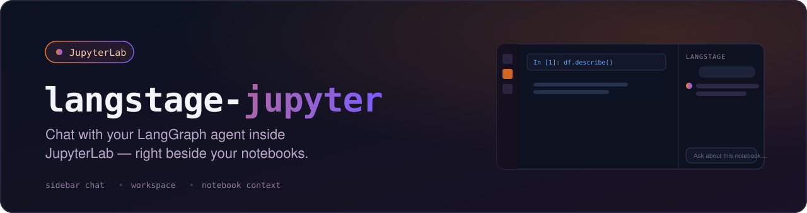

<p align="center">
  
</p>

<p align="center">
    <em>Bring your LangGraph agents into your JupyterLab workflow</em>
</p>

---

* **Source code**: [github.com/dkedar7/langstage-jupyter](https://github.com/dkedar7/langstage-jupyter/)
* **Installation**: `pip install -U langstage-jupyter`  *(renamed from `deepagent-lab` — the old name now just installs this one, and the `deepagent-lab` command still works)*

---

A JupyterLab extension to allow **your** LangGraph agents access to JupyterLab notebooks and files, enabling natural language interactions with your data science projects **directly from JupyterLab**.

<p align="center">
  
</p>

<p align="center"><sub>The keyless demo agent (<code>langstage-jupyter -a langstage_core.demo.tools:graph</code>), recorded by CI against the latest release. <a href="https://dkedar7.github.io/langstage-docs/stages/jupyter/">Docs for the JupyterLab stage</a></sub></p>

Watch the full demo video here: [https://www.youtube.com/watch?v=vGA2vzMSQzo](https://www.youtube.com/watch?v=vGA2vzMSQzo)

## Every stage for your LangGraph agent

langstage-jupyter is the JupyterLab stage of the **LangStage family**: write your agent once — any LangGraph `CompiledGraph` — and run it on every stage with the same spec string (`module:attr` or `path/to/file.py:attr`), the same `langstage.toml` config file, and the same `LANGSTAGE_*` environment variables.

| Stage | Package | Try it |
|---|---|---|
| Web app | [langstage](https://github.com/dkedar7/langstage) | `langstage run --agent my_agent.py:graph` |
| JupyterLab | langstage-jupyter | **you are here** |
| Terminal | [langstage-cli](https://github.com/dkedar7/langstage-cli) | `langstage-cli -a my_agent.py:graph` |
| VS Code | [langstage-vscode](https://github.com/dkedar7/langstage-vscode) | chat participant + stdio sidecar |
| Reference agent | [langstage-hermes](https://github.com/dkedar7/langstage-hermes) | `LANGSTAGE_AGENT_SPEC=langstage_hermes.agent:graph` on any stage |
| Shared core | [langstage-core](https://github.com/dkedar7/langstage-core) | AG-UI streaming bridge + config resolver behind every stage |

### Serve over AG-UI

The chat sidebar already streams every turn through the in-process AG-UI adapter. Your agent — any LangGraph `CompiledGraph` — can also be served over the [AG-UI protocol](https://github.com/dkedar7/langstage-core) as a standalone HTTP endpoint:

```bash
pip install "langstage-core[agui]"
langstage-agui --agent my_agent.py:graph
```

📖 **Full documentation:** <https://dkedar7.github.io/langstage-docs/>

## Features

- **Chat Interface**: Sidebar for natural conversations with your agent
- **Notebook Manipulation**: Built-in tools for creating, editing, and executing Jupyter notebooks
- **Human-in-the-Loop**: Review and approve agent actions before execution
- **Context Awareness**: Automatically sends workspace and file context to your agent
- **Custom Agents**: Use your own langgraph-compatible agents seamlessly
- **Auto-Configuration**: Zero-config setup with automatic Jupyter server detection

## Installation

```bash
pip install langstage-jupyter
```

## Quick Start

### Recommended: Using the Launcher (Zero Configuration)

Instead of `jupyter lab`, use `langstage-jupyter` command for automatic setup.

The easiest way to get started is using the `langstage-jupyter` launcher command, which automatically configures everything for you:

```bash
# Set your API key (if using the default agent)
export ANTHROPIC_API_KEY=your-api-key-here

# Start JupyterLab with auto-configuration
langstage-jupyter
```

That's it! The launcher will:
- Auto-detect an available port (starting from 8888)
- Generate a secure authentication token
- Set the required environment variables
- Launch JupyterLab with the proper configuration

**Using custom arguments:**
```bash
# All jupyter lab arguments are supported
langstage-jupyter --no-browser
langstage-jupyter --port 8889

# Pick the agent right from the launcher (same spec format as every
# LangStage stage; sets LANGSTAGE_AGENT_SPEC for you)
langstage-jupyter -a my_agent.py:graph

# No agent or API key yet? Launch with the keyless demo agent
langstage-jupyter --demo

# Print the resolved configuration (each value, its source, and the
# env var / langstage.toml key that sets it) and exit
langstage-jupyter --show-config
```

**Running several sessions at once:** just launch the command again with a different agent — each
session is its own process, picks the next free port (scanning `8888-8987`), gets its own token,
and its notebook tools only ever talk to its own Jupyter server, so sessions don't interfere:

```bash
langstage-jupyter -a agent_a.py:graph    # -> localhost:8888
langstage-jupyter -a agent_b.py:graph    # -> localhost:8889
```

Widen the scan with `LANGSTAGE_JUPYTER_PORT_ATTEMPTS` (default 100), or pin a port with `--port`
(or `--ServerApp.port`). A pinned port that is busy fails the launch instead of moving to
another port, because the agent's notebook tools are pointed at the port you pinned. `--port 0`
is refused for the same reason.
Note that two sessions launched from the **same directory** serve the same notebooks on disk —
launch from different directories if you want separate workspaces.

### Preflight checks (`--verify`, `--serve-check`, `--check-connection`)

Three headless, no-browser preflights that exit `0`/`1` — handy in CI or before a deploy:

```bash
# Preflight the AGENT OBJECT: load the configured (or --demo) agent and run one real
# turn through it. Catches a bad API key / broken tool / non-runnable graph. (For the
# default agent with no key it now names the missing variable, e.g. ANTHROPIC_API_KEY.)
langstage-jupyter --verify

# Preflight the SERVED ENDPOINT: boot the server extension, poll /langstage-jupyter/health
# until the agent is loaded, then POST one turn to /langstage-jupyter/chat and assert the
# SSE stream completes. Catches route/registration/handler regressions that --verify can't
# (it never touches HTTP). Defaults to the keyless demo agent; add -a to test a real one.
langstage-jupyter --serve-check
langstage-jupyter -a my_agent.py:graph --serve-check

# Preflight the MANUAL-CONFIG CONNECTION: confirm the configured
# LANGSTAGE_JUPYTER_SERVER_URL + LANGSTAGE_JUPYTER_TOKEN actually reach a running,
# auth-matching Jupyter (GET {url}/api/status with the token). Only meaningful for the
# manual-config flow below — the launcher auto-manages these values. (--check-server alias.)
langstage-jupyter --check-connection
```

`--check-connection` names the distinct failure modes:

```console
$ langstage-jupyter --check-connection
[ ok ] reached http://localhost:8888 — token accepted (Jupyter Server 2.20.0)

# wrong port / server not up:
[fail] http://localhost:8888 unreachable — is a Jupyter server running there? ...

# URL right, token wrong (a stale token, a drifted --IdentityProvider.token):
[fail] http://localhost:8888 returned 403 — LANGSTAGE_JUPYTER_TOKEN does not match ...
```

Unlike `--serve-check` (which boots its *own* ephemeral server with a *fresh* token),
`--check-connection` tests your *configured* URL+token against an *already-running* server.

### One-shot chat (`--ask`)

The preflights above prove the agent *runs*; `--ask "<prompt>"` runs one turn and prints
what it actually *says* — the terminal inner loop (change agent -> see the reply) with no
browser, no persistent server, no token juggling. It resolves the agent exactly like
`--verify` (honoring `-a` / `--demo` / `LANGSTAGE_AGENT_SPEC` / `LANGSTAGE_AGENT_MODULE` +
`LANGSTAGE_AGENT_VARIABLE`), prints the reply to stdout and status to stderr, and exits
`0` complete / `1` error / `2` interrupted:

```bash
# One turn, print the reply, exit
langstage-jupyter -a my_agent.py:graph --ask "summarize data.csv in one line"
langstage-jupyter --demo --ask "hello"          # keyless, no API key

# stdout is just the reply, so it pipes cleanly for CI behavior assertions:
langstage-jupyter -a my_agent.py:graph --ask "2+2?" | grep -q 4
```

The extension serves its REST/SSE routes under `/<base_url>langstage-jupyter/`:
`health` (GET), `chat` (POST, SSE), `resume` (POST, SSE), `reload` (POST), `cancel` (POST).

### Alternative: Manual Configuration

If you prefer manual control or need to use `jupyter lab` directly, you can set the environment variables yourself:

1. **Configure environment variables** (create a `.env` file or export):

```bash
# Required: Jupyter server configuration
export LANGSTAGE_JUPYTER_SERVER_URL=http://localhost:8888
export LANGSTAGE_JUPYTER_TOKEN=$(python3 -c "import secrets; print(secrets.token_urlsafe(32))")

# If using the default agent, set your API key
export ANTHROPIC_API_KEY=your-api-key-here
```

2. **Start JupyterLab** with matching configuration:

```bash
jupyter lab --port 8888 --IdentityProvider.token=$LANGSTAGE_JUPYTER_TOKEN
```

**Important:** The server URL and token must match between your environment variables and JupyterLab's startup parameters.

Verify they do — before you start chatting — with the connection preflight:

```bash
langstage-jupyter --check-connection
# [ ok ] reached http://localhost:8888 — token accepted (Jupyter Server 2.20.0)
```

It exits `0` when the configured `LANGSTAGE_JUPYTER_SERVER_URL` + `LANGSTAGE_JUPYTER_TOKEN` reach a running, auth-matching Jupyter, and `1` (naming the reason) when the server is unreachable or the token is rejected.

### Exit codes

`langstage-jupyter` uses the LangStage family's exit codes ([langstage-core ADR 0007](https://github.com/dkedar7/langstage-core/blob/main/docs/adr/0007-family-exit-codes.md)):

| Code | Meaning |
|---|---|
| `0` | success: `--verify` / `--serve-check` / `--check-connection` passed, `--ask` completed, `--show-config` printed, JupyterLab exited cleanly |
| `1` | failure: the agent can't load or its turn errored, a preflight failed, JupyterLab isn't installed, no free port, or JupyterLab itself failed to start (e.g. a busy `--port`) |
| `2` | `--ask` paused on a human-in-the-loop interrupt: the agent is fine but needs input |
| `64` | usage error: a flag without its value (`-a`, `--ask`), `--demo` with `-a`, a malformed `-a` spec, an invalid `--port` |

A plain launch passes JupyterLab's own exit code through, except that a `2` from JupyterLab (its argument parser) becomes `1`, since `2` only ever means "paused". `--serve-check` exits `0` for a HITL agent whose served turn pauses cleanly: the endpoint is healthy.

## Using Custom Agents

langstage-jupyter is designed to work with any langgraph-compatible agent. You can easily use your own langgraph-compatible agents instead of the default agent.

### Creating a Custom Agent

Create a file with your agent (e.g., `my_agent.py`):

```python
from deepagents import create_deep_agent
from deepagents.backends import FilesystemBackend
from langgraph.checkpoint.memory import MemorySaver
import os

# The notebook tools (create_notebook, insert_code_cell, execute_cell, ...).
# Your agent only gets them if you pass them in.
from langstage_jupyter.notebook_tools import NOTEBOOK_TOOLS

# langstage-jupyter sets this before it imports your agent: the pinned
# workspace, else the directory JupyterLab serves.
workspace = os.getenv('LANGSTAGE_WORKSPACE_ROOT', '.')

# Create your custom agent
agent = create_deep_agent(
    name="my-custom-agent",  # Optional: name shown in chat interface
    model="anthropic:claude-sonnet-4-6",
    backend=FilesystemBackend(root_dir=workspace, virtual_mode=True),
    checkpointer=MemorySaver(),
    tools=[*NOTEBOOK_TOOLS],  # add your own tools too, e.g. [*NOTEBOOK_TOOLS, my_tool]
)
```

Leave out `NOTEBOOK_TOOLS` and the agent can still read and write files, but it can't
create, edit or run notebook cells.

### Configuring the Extension to Use Your Agent

Set the `LANGSTAGE_AGENT_SPEC` environment variable to point to your agent:

```bash
# Format: path/to/file.py:variable_name
export LANGSTAGE_AGENT_SPEC=./my_agent.py:agent
```

Then launch as normal:

```bash
# With the launcher (recommended)
langstage-jupyter

# Or manually
jupyter lab --port 8888 --IdentityProvider.token=$LANGSTAGE_JUPYTER_TOKEN
```

The chat interface will automatically display your custom agent's name (if you set the `name` attribute).

### Agent Portability

Agents configured for langstage-jupyter work seamlessly with every other LangStage stage:

```bash
# Same configuration works everywhere!
export LANGSTAGE_AGENT_SPEC=./my_agent.py:agent
export LANGSTAGE_WORKSPACE_ROOT=/path/to/project

# Run in JupyterLab
langstage-jupyter

# Or in the browser / terminal
langstage run
langstage-cli
```

With a pinned `LANGSTAGE_WORKSPACE_ROOT`, `langstage-jupyter` serves that directory in
JupyterLab (it passes `--ServerApp.root_dir`), so the file browser, the agent's file tools
and its notebook tools all use the same directory. The notebook tools go through
JupyterLab's contents API, so they always work in the directory JupyterLab serves. If you
pass your own `--notebook-dir` / `--ServerApp.root_dir`, or run plain `jupyter lab`, and it
differs from the pinned workspace, the launcher and the server log print a warning: file
tools then use the workspace and notebook tools use the serving root.

## Environment Variables

All configuration uses the `LANGSTAGE_` prefix (the pre-rename `DEEPAGENT_` names still resolve as deprecated fallbacks):

| Variable | Purpose | Default | When to Set |
|----------|---------|---------|-------------|
| `LANGSTAGE_AGENT_SPEC` | Custom agent location (`path:variable`) | Uses default agent | Optional: for custom agents |
| `LANGSTAGE_WORKSPACE_ROOT` | Working directory for agent (set before your agent is imported) | JupyterLab root | Optional |
| `LANGSTAGE_JUPYTER_SERVER_URL` | Jupyter server URL | Auto-detected | Manual config only |
| `LANGSTAGE_JUPYTER_TOKEN` | Jupyter auth token | Auto-generated | Optional: pins the launcher's token |
| `LANGSTAGE_MODEL_TEMPERATURE` | Default agent's sampling temperature | `0.0` | Optional |
| `ANTHROPIC_API_KEY` | Anthropic API key | None | Required for default agent |

When using the `langstage-jupyter` launcher, `LANGSTAGE_JUPYTER_SERVER_URL` and `LANGSTAGE_JUPYTER_TOKEN` are automatically configured and don't need to be set. To pin the launcher's token, set `LANGSTAGE_JUPYTER_TOKEN` (or `jupyter.token` in `langstage.toml`). The launcher picks the token in this order: `--IdentityProvider.token`, then `LANGSTAGE_JUPYTER_TOKEN` (legacy `DEEPAGENT_JUPYTER_TOKEN`, with a deprecation notice), then `JUPYTER_TOKEN`, then a generated one.

`LANGSTAGE_MODEL_TEMPERATURE` must be a finite number from 0 up to the provider's maximum (1 for Anthropic, 2 for OpenAI and Gemini). Any other value is ignored with a `note:` and the default `0.0` is used.

See [.env.example](https://github.com/dkedar7/langstage-jupyter/blob/main/.env.example) for a complete configuration template.

## Interface Controls

- **⟳ Reload**: Reload your agent without restarting JupyterLab (useful during agent development)
- **Clear**: Start a new conversation thread
- **Status Indicator** (hover for details):
  - 🟢 Green: Agent ready — it can actually run a turn
  - 🟠 Orange: Loaded but not ready — e.g. the default agent's `ANTHROPIC_API_KEY` isn't set (the first turn would fail), or an uncompiled graph was exported. The tooltip says what to fix.
  - 🔴 Red: Agent error — the agent module didn't load

## Development

See [CONTRIBUTING.md](CONTRIBUTING.md) for development setup and guidelines.

## License

MIT License - see [LICENSE](LICENSE) for details.
